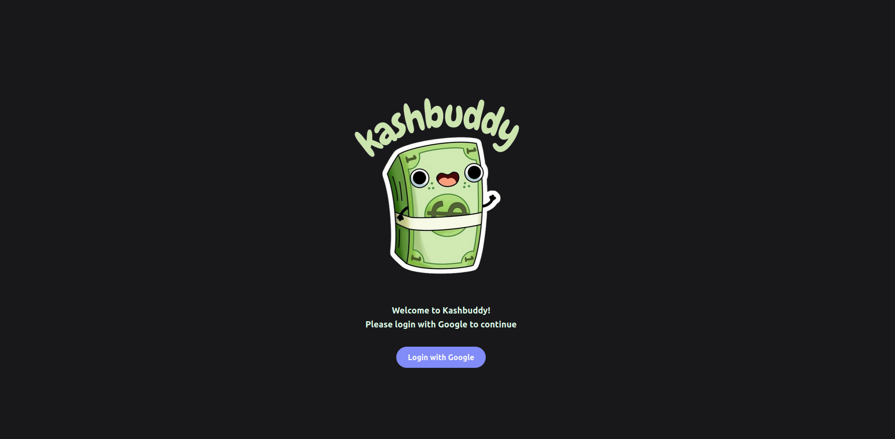

<h1 align="center"> KashBuddy </h1>

  This is my first Full Stack project using React and Firebase. It consists of an expenses-tracker that allows users to register and manage their financial transactions, categorise them and visualise their net worth across different bank accounts.

<a href="https://kashbuddy.vercel.app/"> Project Link </a>

  

## Key Features

- **User Registration and Authentication**: 
  Users can sign up and log in securely using Firebase Authentication.

- **Bank Account Management**: 
  Add, edit, and delete bank accounts, each with a name and associated balance.

- **Transaction Logging**: 
  Record financial transactions with description, amount, category, type (income or expense), date, and associated account.

- **Transaction Categories**: 
  Create and manage custom categories to organize income and expenses.

- **Net Worth Visualization**: 
  Automatically calculate and display the user's net worth by summing all account balances and adjusting for transactions.

- **Financial Statistics**: 
  View financial insights with bar charts showing totals by transaction category.

- **Intuitive User Interface**: 
  Built with React components and styled using Tailwind CSS for a clean and modern experience.

## Development tools

This project was made using:

- ReactJS/JavaScript
- Firebase
- Git e Github
- Figma

## Available Scripts

Here are the scripts you can use to run or build the project:

- **`npm start`**: Runs the app in development mode.  
- **`npm run build`**: Builds the app for production.  
- **`npm run eject`**: Extracts the app's configuration for further customization.

---

 Feito com ♡ por Joana M 

